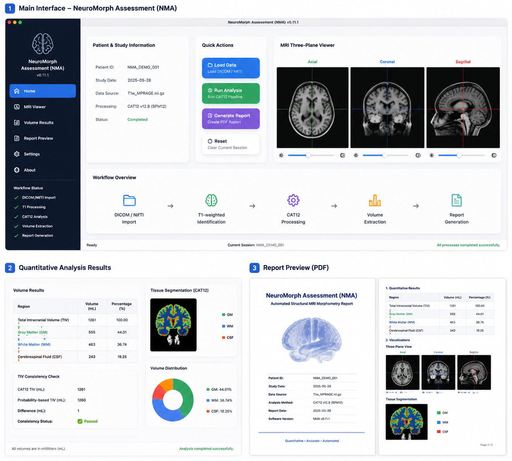

# NeuroMorph Assessment (NMA)

## Screenshot



## Overview

NeuroMorph Assessment (NMA) is an automated structural MRI morphometry
and CAT12-based brain volume analysis system.

The software integrates MRI data organization, CAT12 processing,
quantitative brain tissue measurement, visualization, and automated
report generation into a unified workflow.

## Key Features

### Automated MRI Workflow

-   MRI data import and organization
-   T1-weighted image identification
-   CAT12 processing integration
-   Brain tissue segmentation
-   Quantitative volume extraction
-   Visualization
-   Automated report generation

### Quantitative Morphometry

NMA extracts structural measurements including:

-   Total intracranial volume (TIV)
-   Gray matter volume (GM)
-   White matter volume (WM)
-   Cerebrospinal fluid volume (CSF)

The system includes quantitative consistency validation during result
extraction.

### Visualization and Reporting

Features include:

-   MRI three-plane visualization
-   Quantitative result preview
-   Processing progress monitoring
-   Automated PDF report generation

## Workflow

``` text
MRI Data
   |
   v
Data Import
   |
   v
T1 Image Detection
   |
   v
CAT12 Processing
   |
   v
Tissue Segmentation
   |
   v
Volume Quantification
   |
   v
Visualization and Report
```

## Project Structure

``` text
NeuroMorph-Assessment/

├── src/
│   ├── app.py
│   ├── ui.html
│   ├── NMAWebView.m
│   ├── launcher.sh
│   └── Info.plist
│
├── resources/
├── scripts/
├── examples/
├── docs/
├── requirements.txt
└── README.md
```

## Installation

Requirements:

-   macOS
-   Python 3.x
-   MATLAB with SPM12
-   CAT12 toolbox
-   dcm2niix

Python dependencies are provided in:

``` text
requirements.txt
```

## Usage

1.  Import MRI data.
2.  Configure analysis environment.
3.  Run the processing workflow.
4.  Review quantitative results.
5.  Generate reports.

## Documentation

Additional documentation is available in:

``` text
docs/
```

## Version

Current version:

``` text
v0.11.1
```

## Citation

Citation information will be updated with the final publication or
software registration information.

## License

License information will be added after dependency review.

## Acknowledgements

This project uses open-source neuroimaging tools including SPM12 and
CAT12.
