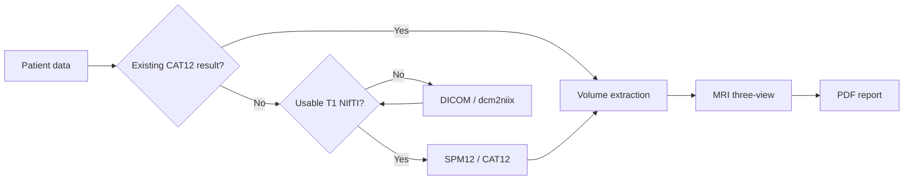

# NeuroMorph Assessment (NMA)

**NeuroMorph Assessment (NMA)** is a local macOS application for structural MRI morphometry, CAT12 workflow orchestration, quantitative brain-volume extraction, MRI three-view visualization, scale-data display, and automated report generation.

**NeuroMorph Assessment（NMA）** 是一个本地运行的结构 MRI 定量分析与自动报告应用，整合患者数据导入、DICOM/NIfTI 处理、SPM12/CAT12 调用、脑体积读取、MRI 三切面可视化和报告生成。

Current version: **v0.11.1**

## Features

- Excel batch import and single-patient manual entry
- Case-directory matching by normalized case identifiers
- DICOM to NIfTI conversion through dcm2niix when required
- Automatic 3D T1 sequence selection
- Automated MATLAB / SPM12 / CAT12 workflow
- Reuse of valid existing CAT12 results
- TIV, GM, WM and internal CSF extraction
- TIV consistency validation in v0.11.1
- Sagittal / Axial / Coronal MRI preview
- MCCA, MMSE, HAMA and HAMD data display
- Automated PDF/PNG report output
- Native macOS directory authorization
- Isolated backend session and task logs

## Workflow



## Repository structure

```text
NeuroMorph-Assessment/
├── src/
│   ├── app.py
│   ├── ui.html
│   ├── NMAWebView.m
│   ├── launcher.sh
│   └── Info.plist
├── resources/
│   ├── AppIcon.png
│   ├── AppIcon.icns
│   ├── NMA_VERSION.txt
│   ├── report_template.docx
│   └── template_background.png
├── scripts/
│   └── build_macos_app.sh
├── examples/
│   └── config.example.json
├── docs/
│   └── USER_GUIDE.md
├── requirements.txt
├── THIRD_PARTY.md
└── CHANGELOG.md
```

## Requirements

- macOS 12 or later
- Python environment with packages in `requirements.txt`
- MATLAB
- SPM12
- CAT12
- dcm2niix
- Xcode Command Line Tools (`clang`) for the native WKWebView host

External components are not included in this repository. See [THIRD_PARTY.md](THIRD_PARTY.md).

## Python dependencies

```bash
python -m pip install -r requirements.txt
```

## Configuration

A configuration example is provided in [`examples/config.example.json`](examples/config.example.json). The application also provides a settings interface for selecting and authorizing local paths.

Do not commit patient data or local configuration. The repository `.gitignore` excludes common DICOM/NIfTI, spreadsheet, CAT12 output, runtime, and log files.

## Build the macOS app

```bash
bash scripts/build_macos_app.sh
```

The application bundle will be created at:

```text
dist/NeuroMorph Assessment.app
```

## v0.11.1 TIV validation

CAT12 absolute tissue volumes satisfy the consistency relationship

```text
TIV ≈ CSF + GM + WM
```

v0.11.1 validates directly parsed TIV values against the tissue-volume scale. If the direct TIV value is clearly inconsistent, NMA falls back to the consistent absolute tissue-volume sum.

## Documentation

See [`docs/USER_GUIDE.md`](docs/USER_GUIDE.md) and [`CHANGELOG.md`](CHANGELOG.md).

## License

A project license has not yet been selected. Before changing the repository from Private to Public, add an explicit open-source license appropriate for the project and its dependency model.
